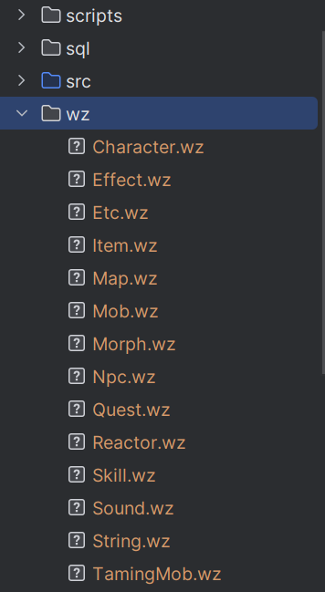

# 说明
仓库来源：https://github.com/v3921358/OdinMS-v53-R877.git

感谢所有愿意分享的人!

> 冒险岛不是一个游戏，而是一种回忆。每个人的回忆都不同，希望每个人都能找到自己的回忆.

# 环境说明
1. jdk1.7
2. mysql5.5
3. IDEA启动
4. 启动参数参考``bat``

# 准备事项
1. 导入sql文件夹下的sql到数据库
数据库配置在``db.properties``中设置，当前配置
```sql
# qualified class name of your JDBC driver
driver=com.mysql.jdbc.Driver
# JDBC URL to your database
url=jdbc:mysql://127.0.0.1:3305/odinms
# credentials for database access
user = root
password = 123456
```
2. 项目根目录创建wz文件夹，把客户端的wz文件都放入wz文件夹中
 


# 启动步骤
1. 先启动 ``WorldServer.java``
启动参数：
> -Dnet.sf.odinms.recvops=recvops.properties
-Dnet.sf.odinms.sendops=sendops.properties
-Dnet.sf.odinms.wzpath=.
-Djavax.net.ssl.keyStore=world.keystore
-Djavax.net.ssl.keyStorePassword=mysecretpassword
-Djavax.net.ssl.trustStore=world.truststore
-Djavax.net.ssl.trustStorePassword=mysecretpassword

2. 启动 ``LoginServer.java``
 启动参数：

> -Dnet.sf.odinms.recvops=recvops.properties
-Dnet.sf.odinms.sendops=sendops.properties
-Dnet.sf.odinms.wzpath=.
-Dnet.sf.odinms.login.config=login.properties
-Djavax.net.ssl.keyStore=login.keystore
-Djavax.net.ssl.keyStorePassword=mysecretpassword
-Djavax.net.ssl.trustStore=login.truststore
-Djavax.net.ssl.trustStorePassword=mysecretpassword

3. 启动 ``ChannerServer.java``
> -Dnet.sf.odinms.recvops=recvops.properties
-Dnet.sf.odinms.sendops=sendops.properties
-Dnet.sf.odinms.wzpath=./wz
-Dnet.sf.odinms.channel.config=channel.properties
-Djavax.net.ssl.keyStore=channel.keystore
-Djavax.net.ssl.keyStorePassword=mysecretpassword
-Djavax.net.ssl.trustStore=channel.truststore
-Djavax.net.ssl.trustStorePassword=mysecretpassword

4. enjoy
